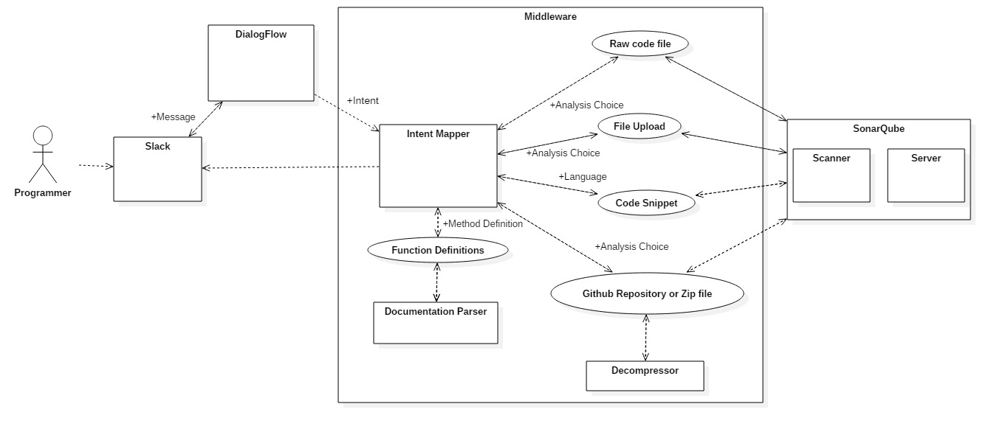

## Introduction 
 
The service implementation of the code training bot consists of three use cases proposed in the [design](https://github.ncsu.edu/rshah8/Design-Milestone) and two additional cases which we thought are nice to have in the application.
A video demonstration of functionality of all the cases is available [here](https://youtu.be/7Ykn8BmevRE).

## Components

The following is the diagram containing major modules and use cases of the project:

The implementation comprises of the following APIs and modules - 

#### NodeJS 

#### Botkit
The botkit NPM module allows simple integration with the slack RealTime Messaging (RTM) API and offers support for almost all the APIs supported by Slack. For the bot to detect messages from users, the following events are being monitored  - Direct_message, Direct_mention, File_share. 

#### Dialogflow
Dialogflow provides AI-powered conversional interfaces that can be easily trained and integrated to any platform. The ‘apiai’ node module has been used to interface with dialogflow.   
All inputs sent by the user Slack are sent to dialogflow in order to extract an intent from the user’s natural language message. We have created the following intents 
 
#### Process Intents
These are the intents that trigger a particular process  

**GenericAnalysis** - This intent handles the conversion that leads the user to sending a GIT url or uploading a source file
* AnalysisChoice - This intent handles
* DefMethod - 
* Language - 

**Generic Intents** - These intents enrich the conversion with the user.
* Greeting - Handles greetings from the user
* Help - Handles any help requested by the user
* Farewell - Handles goodbyes

#### SonarQube
SonarQube is an open source platform for continuous inspection of code quality to perform automatic reviews with static analysis of code to detect bugs, code smells, and security vulnerabilities on 20+ languages like Java, JavaScript, Python etc. It offers reports and recommendations on any discrepancy it finds on the analysed code

It consists of a scanner and a server module. The scanner can be invoked on source files. Once the scan completes, the server module can be used to peruse the issues and recommendations. The server also provides a WebAPI which we have utilized in this project.

[Source](https://en.wikipedia.org/wiki/SonarQube), [Homepage](https://www.sonarqube.org/)

#### Downloader
There are several options available in NPM for downloading a file. For our requirements, we require the following features 
* Downloader should return a Promise
* Downloader should support Authentication headers

We borrowed these features from several modules and bundled them into a single downloader module.

## Process Considerations

#### Asynchronous Event Handling

All the asynchronous operations - downloading, scanning and retrieving are handled using JavaScript Promises. These Promises are chained to make sure they are called one after the other. 

In Sonarqube, there is a small delay between the completion of scan and the availability of the results on the server. Therefore, the results cannot be obtained right after the scan is complete, even while using Promises. Instead, we pol the server’s web api for the status of the scan. Once a valid status is available, we can start retrieving the results

#### Session Handling

The following measures have been taken to ensure multiple users can use the application without conflicts.- A session ID is generated using the User Id value from Slack and a unique timestamp. The Slack User ID value is used as a session Id for Dialogflow API calls to prevent any intent conflicts between multiple users. All downloads and scans take place in separate directories that are named after the session ID.

## Assumptions

## Limitations 

The following are the limitations of the bot which we have found during our development. These limitations do not limit the bot from its main functions to a great extent and allow the bot to work as expected.

* Slack cannot authorize the bot to download files on Direct Message. Hence, files uploaded on direct message to the bot will not be downloaded, and hence, won’t be analysed (unless you are the owner of the bot). In order to make the bot analyse files, you must send the file on any of the slack channel where the bot is a member, along with @”bot_name” in the description of the file.
* Sonarqube does not scan projects having multiple java files without their binaries (.class files). This can be overcome in future using the mvn sonar:sonar command, but is not in the scope of the current project. 
See: https://docs.sonarqube.org/display/PLUG/SonarJava\
* Documentation module tells you the description of basic functions. Conceptual knowledge is not expected. The Documentation module supports only Java and Python functions for now.
* The bot only gives out the first 10 issues to avoid long messages in chat window. This is not a limitation but we thought it is better to mention this here. In order to access the other issues in the files, the user will need to solve the first 10 issues and then send the code for analysis again (for this milestone).
* Performance of the bot might be impacted when multiple users try to analyse their code/projects simultaneously. Both the project outputs will be queued and displayed when both operations are over. This is because javascript is not multithreaded.

## Future improvements 

## References

