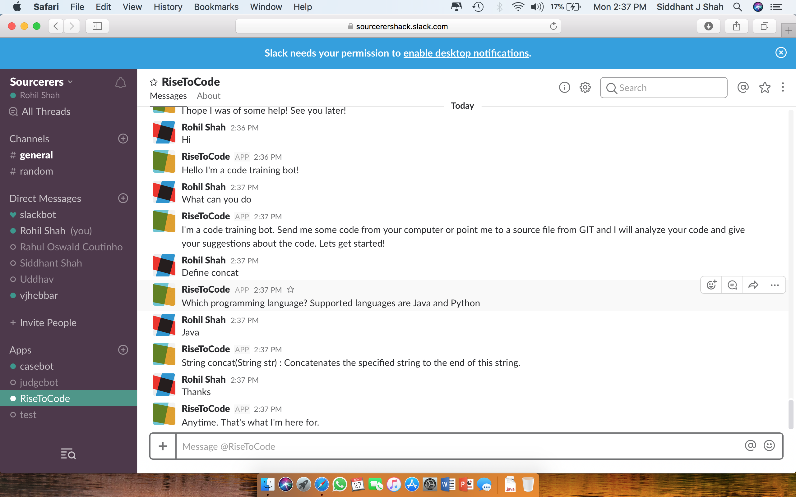
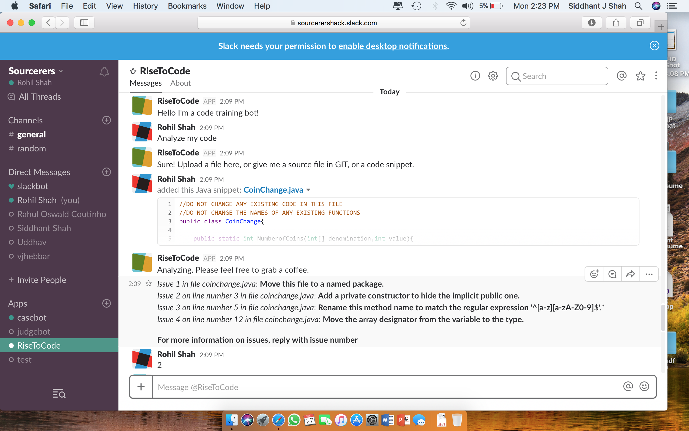
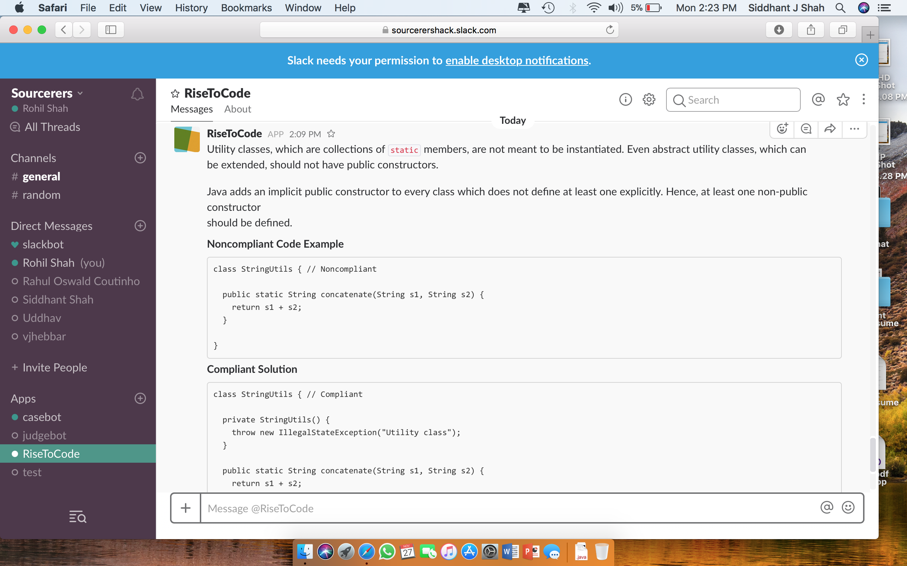
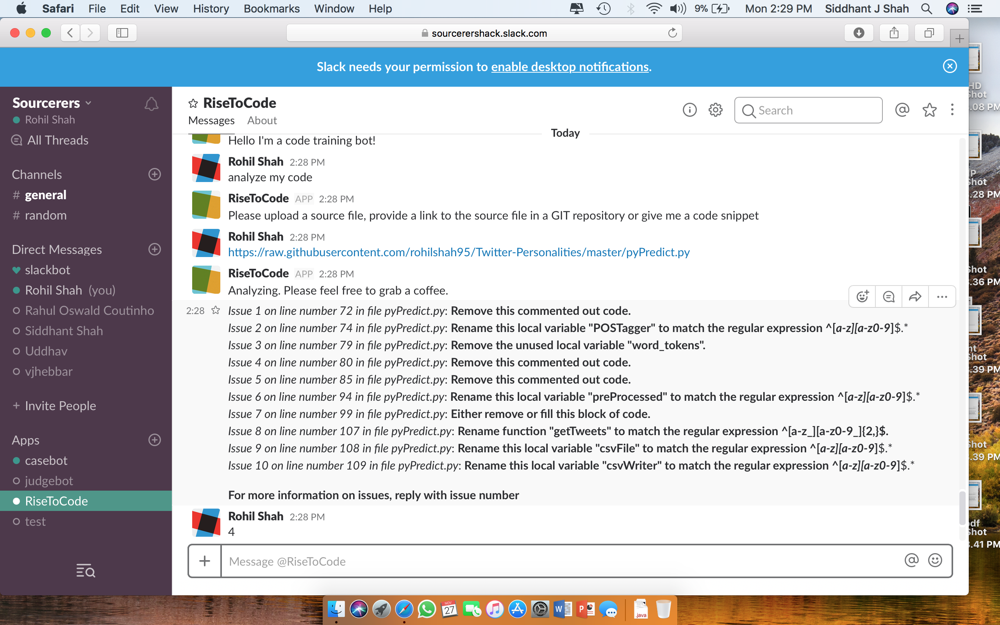
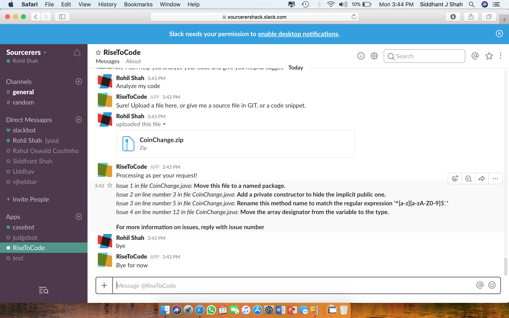
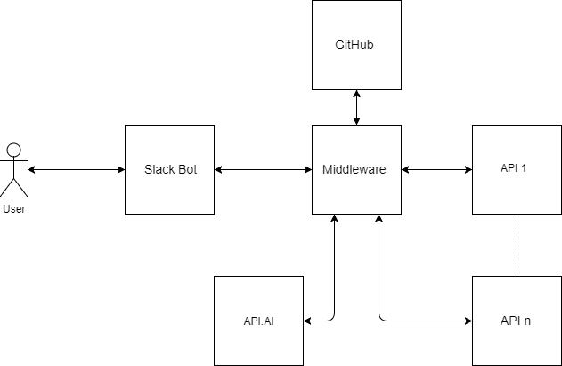
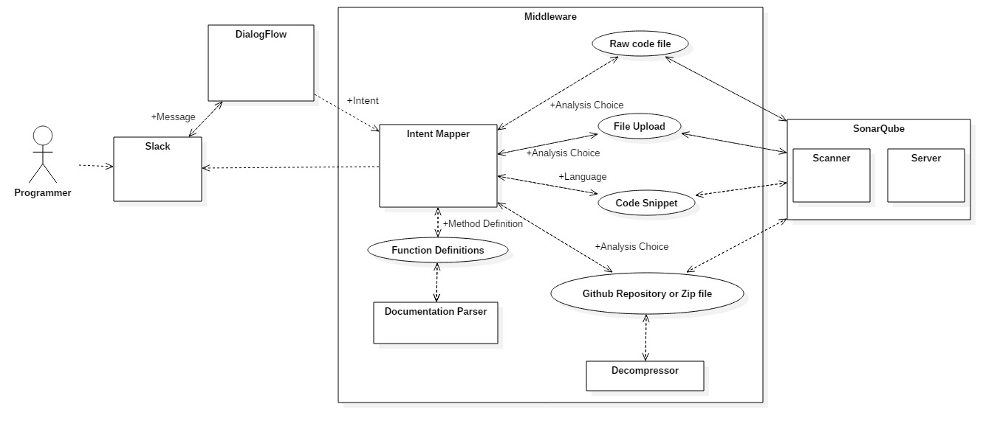

# Project Report -> BotsUp  
**CSC 510 - BotsUP**

Members:  

Rohil Shah: rshah8  
Rahul Coutinho: rcoutin  
Siddhant Shah: sshah14  
Uddhav Bhosle: ubhosle  
Vijay Hebbar: vhhebbar  
  
# Problem Statement:  
People new to programming or skilled programmers learning new languages can come across many problems while coding. These problems act as impediments to their learning process. The code could be riddled with bugs like null pointer exceptions, vulnerabilities, duplicated code, spaghetti code and deviations from coding standards. These issues cause headaches when developing an application or merely programming for the sake of it. Early and efficient detection of these problems is a growing need for any software development project. With novice programmers who might not be familiar with the syntax and/or programming basics and protocols, there are increased chances of bugs. Also, they are not familiar with the functions and rules of the language and are thus bound to get stuck finding solutions to things that an experienced person might find trivial.
Hence there arises a need for a tool that goes through the bugs individually and provides tips and solutions to solve them, making the programmers code complaint to coding standards. With such a tool the programmers will find it easy to exactly know what is wrong with their own code without having to research (in theory) about the kind of bugs they are facing due to lack of knowledge about the programming language.    

# Features   
The interactive chat-bot is capable of answering questions related to the documentation of the particular programming language that the user is using. Below we can see the bot helping in method definitions for a particular language.  
  
    
Here we see that the user asked for the definition of a method. However, he did not mention the language for which the method is requested. Hence the bot asked the user which language he is talking about. On getting the language the bot maps to the database of that language and searches for the necessary method. If found it replies with the what the method does, otherwise it tells the user that it could not find any information. Here the bot replied with what the java method does.    

The chat-bot checks for bugs in the code and purveys the issues to the user. The user can further interact with the bot for particular issues for which the bot gives the user the required solutions. The user can provide the code to the bot in various forms that are best suited for this application.   
He can provide the bot with a code file. Such files are stored in their programming language extensions and hence help the bot know the language for which it has to run the analysis.
   
  
  
Here the user uploaded a java file with to be analyzed. The bot successfully analyzed the file and got all the issues in it. It then sorts the issues in decreasing order of severity and displayed the 10 most severe issues. The user then went ahead and typed '2' to know more about the issue number 2. To this, the bot gave a detailed explanation of the issue along with examples of compliant and noncompliant codes. As the user solves the top issues, he can re-upload the file to get more of the remaining issues.   
 
The user may be working on a platform like GitHub, which is supported by the bot. He can simply give a link to the raw file in GitHub and the bot downloads and analyzes the code to give issues if any. Then again the user may proceed to learn about some specific issues if need be.
    
   
Here the user provided a link to a raw file in GitHub having a python code. The bot analyzed it and gave the issues and the user continued with the specific issue for which he wanted more information. He can get more information on any issue any number of times.   
   
It may happen that the user is unsure of a part of his code. He doesn't want the bot to analyze his whole file, he can also give it a code snippet, that is, only the part of the code he wants to analyze. The bot will analyze it and give back results and the conversation can be continued as in the above cases.
     

Now, what if the user wants to analyze his whole project?! He can give the whole zipped project folder or a link to his GitHub repository. The bot will download and analyze the entire project and give the results of its analyses. The most severe issues from the project are displayed which will help the user to learn more about the bugs or solve them.
    
  
All these features help in the better understanding of one's code and the programming language used. These will help novice programmers learn to code without being intimidated and using the interactive bot just like a person helping with the code.
   
# Development   
While starting with the project we had a vague idea of how the bot must function and what needs to be done for its development. We decided on making a bot using the Slack platform. Our initial plan was something like this   
    
Initially, we were not sure as to which API to use for the code analysis. Also finding an API service that provided support for a wide range of languages was an issue. But over time we finalized on using the SonarQube API which provided support for a wide range of programming languages and also provided functionalities like static code analysis, efficient processing of requests,  the severity of issues to name a few. This API formed the core functionality provider for our bot.   
Offering support for various definitions of methods, classes etc for languages was one of the important functions which our initial design did not do justice to.   
    
Coming to the providing natural language support and a humanoid feeling to the conversation we had to use the DialogFlow API(formally known as, api.ai).

From this rough idea, we went on to the refined design of our bot, which is this
     
Now we had finalized the SonarQube API and designed the interface in our middleware that would interact with the API to give the required analysis. Over the period of our project, we refined the use cases and added use cases to our project. These use cases denoted the various ways a user could interact with the bot and also provided an idea of what must be programmed in the bot.    
   
One such use cases were to analyze codes and projects from GitHub. Hence we had to set up the interface between GitHub and the bot so that the bot can access the GitHub files.   
       
Going to the part where our bot had to give various definitions and answer questions about some language, we started with just a file from the java documentation. The bot would access this file and check for method and class definitions. From here we went to add more files from the java documentation to support the bot's solution finding process. Now the bot would iterate over all the files to find an answer to the given question. We went on to extend the service to the python language. Now the bot had to first know which language the user is referring to in his question in order to answer go ahead with its search. This was an added problem that we solved using the natural language processing capabilities of the DialogFlow API.     
   
The DialogFlow API not only provided with the user-friendly and human-like responses but also helped in analyzing and getting information from the user's natural language. As the user's language was bound to be varying for the same tasks, it was necessary to interpret the intent of the user and hence proceed with the appropriate execution flow in the bot. For this, the dialog flow API had to be trained to understand the human language and which intent any message corresponds to.   
   
While working on building the bot we came across many hurdles that needed to be solved. One of them was allowing concurrent access to the bot by more than one user. Once our initial implementation was done, we found out that there was something fundamentally wrong with our bot. It would fail to respond correctly if more than one user used at simultaneously. To solve this issue, we had to maintain session ids for each issue and pass all the messages within the bot middleware using this unique id. Even the files downloaded for analyses and uploading to the SonarQube API along with the output of the Sonarqube API had to be mapped to these session ids. Once we did this, the bot could now be accessed by more than one user simultaneously and all their individual messages and data along with the messages meant to be sent to them were linked to their session id. This ensured that every user got the correct response and a reply to his queries only.      
        
# Limitations and Future Work
One of the limitations of the bot is the limited number of languages supported are few. We will need to work on the scalability of the bot so that it can gracefully support a large number of languages.   
   
One of the limitations of Slack is that only the admin user can upload files. This is a severe limitation as it prevents other users from accessing some of the crucial functionalities of the bot. The bot can be redesigned on a platform that allows all users the same rights so that they can access all the functionalities of the bot or at least those functionalities that are intended for them.   
    
One of the problems in SonarQube API is that it cannot analyze two or more java files together if we don't provide the class files along with them. This prevents and restricts users and is a pain as users have to compile and create class files first in order to check their code.   
Other drawbacks of this API are that it may provide issues that may be irrelevant to a user and actually not make the code any better if solved. To solve it, we need to create a mechanism for the bot to figure out whether the issues are really necessary ones and display them only if they can improve the overall code quality.   
   
The bot can be further developed to make it much more user-friendly and intuitive. The more human-like the bot is, the more the chances that a user will continue to use it. Making it more user-friendly would help in the solving the problems of the user in a much better way. The user's naivety must not result in any hindrance to his ability to use the bot to its fullest usability.
